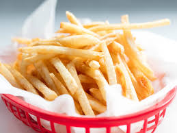

# 🍱 Food Calorie Estimator Desktop App

An intelligent desktop application that estimates **daily calorie needs** and predicts **calories in food images** using machine learning.

Built using **PyQt5**, trained on the **Food-101 dataset**, and integrated with a user-friendly GUI that supports **image-based calorie tracking**.

---

## 📷 Demo Preview

>   
_Example input image for prediction._

---

## 🔍 Problem Statement

Calorie tracking is crucial for fitness, weight management, and healthy living. Manually tracking food intake is tedious and prone to errors.

This app aims to:
- Automatically calculate **daily calorie needs**.
- Predict calories in a food item by analyzing an **uploaded image**.
- Log and **track daily food entries** with timestamp and nutrition info.

---

## 🧠 Tech Stack

| Area                  | Tool/Library                     |
|-----------------------|----------------------------------|
| GUI                   | PyQt5                            |
| ML Model              | TensorFlow / Keras               |
| Image Processing      | OpenCV                           |
| Data Storage          | CSV + In-Memory Python Storage   |
| Dataset Used          | Food-101                         |

---

## 🧮 Functionalities

- 👤 User info input (age, height, weight, gender, activity)
- 📉 Option to reduce 0.5kg/week
- 🧠 TDEE calculation (Total Daily Energy Expenditure)
- 📷 Upload food image → food name + calorie prediction
- 📊 Tabular logging of food consumed (with total sum)
- ⏳ Show date and time of each food entry
- 📁 Maintain recent users for quick reload
Food-101 Dataset
Source: Kaggle - Food-101

Contains 101,000 labeled food images (101 classes × 1000 images)

Used to train a CNN model to classify uploaded food images.

Model output → food label → matched against food.csv for calorie values.

🧠 Model Overview
Trained in: Food101_Final.ipynb

CNN-based image classifier

Preprocessing with OpenCV

ResNet or custom CNN layers

Final softmax activation over 101 food categories

Saved as .h5 file and loaded in Process.py

🛠 How It Works
User fills form: age, weight, height, gender, activity level

App calculates daily calorie need using standard BMR + activity multiplier

User uploads food image (e.g., new.jpg)

Image processed → passed to CNN model → predicts food name

Match food name with food.csv → get calorie/100g

User enters grams eaten → calculates actual calorie

Result is shown in a table with timestamp and added to total.

🚀 How to Run
1. Clone the repository
bash
Copy
Edit
git clone https://github.com/yourusername/food-calorie-estimator.git
cd food-calorie-estimator
2. Install dependencies
bash
Copy
Edit
pip install -r requirements.txt
If requirements.txt is missing:

bash
Copy
Edit
pip install PyQt5 numpy pandas scikit-learn tensorflow keras opencv-python
3. Run the application
bash
Copy
Edit
python food.py
🔧 Sample User Flow
Launch app using above command

Enter details:

Name: Isha

Age: 22

Height: 160 cm

Weight: 53 kg

Gender: Female

Activity: Medium

Click Calculate → Calorie requirement shown

Browse food image (new.jpg)

Enter gram (e.g., 150g) → Submit

Food name, calorie/100g, total calories, and time will show in a table

